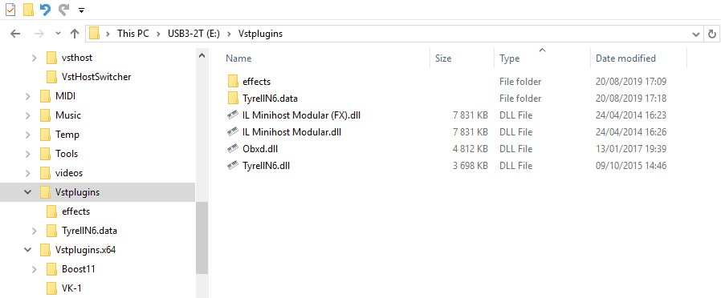
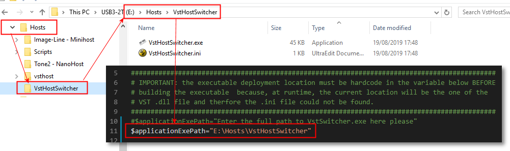
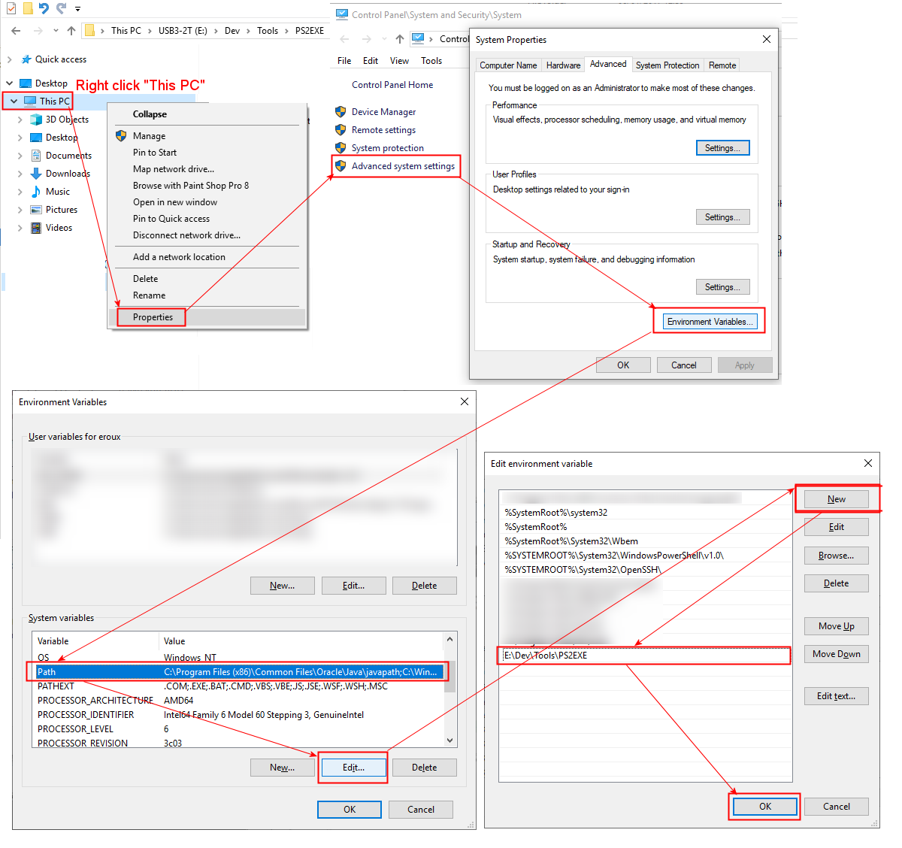
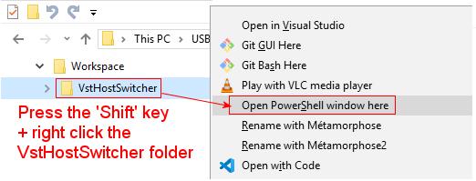
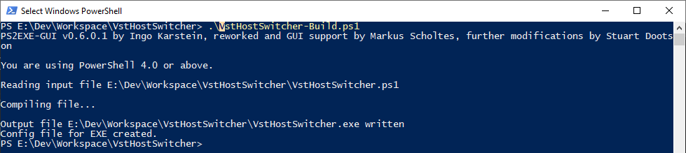
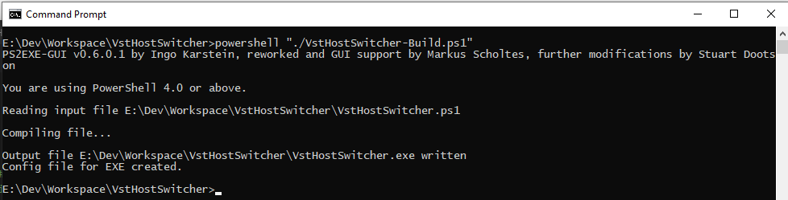
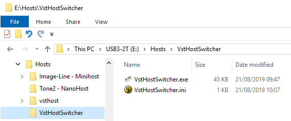
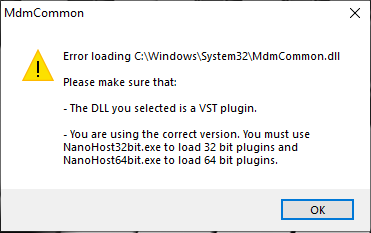
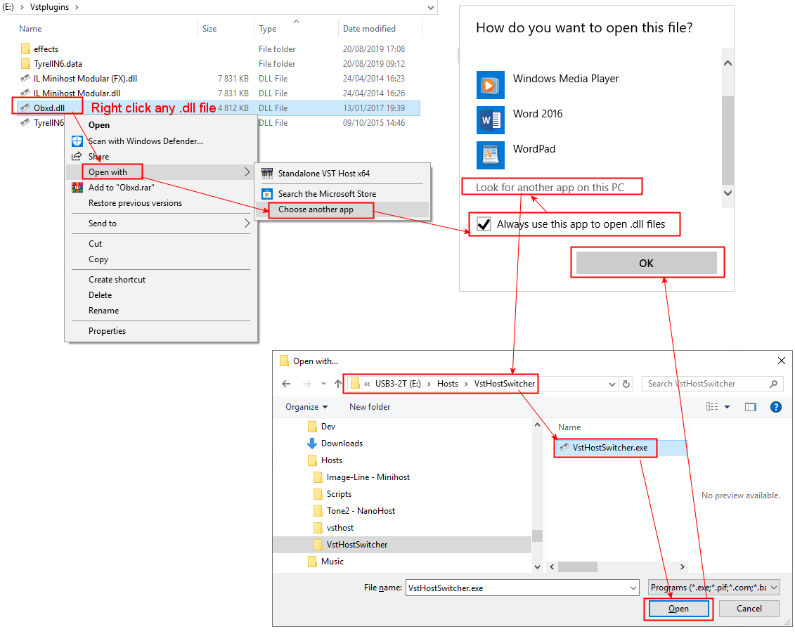

# VstHostSwitcher

English version [here](./README.md)

## Description

Le but de ces petits [scripts PowerShell](https://docs.microsoft.com/fr-fr/powershell/scripting/overview?view=powershell-6) est de simplifier le basculement automatique entre des application host de VST plugins 32 et 64 bits installés sur mon PC sous MS Windows.

Si vous avez à la fois des version x86 et x64 de plugins VST et que vous n'avez pas toujours besoin (ou envie) d'ouvrir une DAW qui met qq minutes à démarrer pour simplement creer de nouveaux presets de sons, vous utilisez probablement déja un des host VST listés ci-dessous:

- [Tone 2 Nanohost](https://www.tone2.com/nanohost.html)
- [Image-Line MiniHostModular](https://forum.image-line.com/viewtopic.php?f=1919&t=123031)
- [Hermann Seib vsthost](http://www.hermannseib.com/english/vsthost.htm)

Le probème est que les plugins VST 32 bits ne peuvent être ouverts avec un host de VST 64 bits et vice versa. Par conséquent, mon idée était de créer un executable qui pourrait faire le basculement automatique pour moi entre le choix d'un host VST 32/64 bits et ensuite d'associer cet executable avec l'extension de fichier ``.dll`` depuis l'explorateur de fichier MS Windows. De cete façon, simplement en double cliquant n'importe quel fichier ``vst.dll`` je pourrai ouvrir cette dll avec mon host de VST preferré **independamment du fait que le fichier .dll est une version 32 ou 64 bit de ce Plugin VST**:

Afin d'arriver à cela j'ai eu besoin des étapes suivantes:

- [Creer un script contenant la logique pour basculer entre la version 32 ou 64 bits de VST host.](#ANCHOR_SCRIPTS)
- [Trouver une façon de spécifier des preference de configuration personnelles](#ANCHOR_SETTINGS)
- [Trouver un outil pour compiler ce script en un fichier executable MS Windows.](#ANCHOR_EXE)
- [Associer cet executable avec n'importe quelle fichier .dll.](#ANCHOR_FILE_ASSOCIATION)

## Pourquoi deux scripts .ps1

Le script ``VstHostSwitcher-Build.ps1`` est un fichier d'exemple qui est fourni pour simplifier le  **build** du script ``VstHostSwitcher.ps1`` vers un executable MS Widnows. Je donnerai plus de détails sur la façon de contruire cet executable [plus loin a la fin de ce document](#ANCHOR_EXE).  

Le script ``VstHostSwitcher.ps1`` contient simplement la logique pour _deviner_ si le ``chemin-vers-la-dll-alancer`` est un dossier 32 ou 64 bits.  

**IMPORTANT**  
Merci de bien vouloir éditer la variable ``$applicationExePath`` à la ligne 10 du script ``VstHostSwitcher.ps1`` afin de définir l'endroit ou vous allez copier et installer le fichier  ``VstHostSwitcher-Build.exe`` executable construit a partir du script.

Cette variable ``$applicationExePath`` pointera vers le chemin / dossier qui va contenir le fichier executable ``VstHostSwitcher.exe`` ainsi que le fichier ``VstHostSwitcher.ini`` associé. Si cette variable n'est pas définie, le fichier executable ``VstHostSwitcher.exe`` ne sera pas en mesure de trouver le fichier ``VstHostSwitcher.ini`` contenant les preferences personnelles de configuation necessaires pour que le ``VstHostSwitcher.exe`` retrouve les chemins d'installation pour les VST plugins et hosts qui sont bien évidement differents d'une machine a l'autre.  
Dans l'exemple ci-dessous j'ai deployé installé ces deux fichiers dans le dossier ``E:\Hosts\VstHostSwitcher``:

L'_emplacement_courant_du_script_ ne peut malheureusement être deviné / utilisé à l'execution script, car cet emplacement est remplacé par le chemin vers la ``.dll`` du VST plugin qui est donné en argument au script durant l'execution de l'application ``VstHostSwitcher.exe``. Je n'ai pas pu trouver un moyen de corriger ce problème, par conséquent toutes les suggestions seront les bienvenues. Merci par avnce pour votre aide.  

## Customisation personelle des chemins

Il est possible de définir vos propres structures de répertoires ou sont stockées vos VST plugins ainsi que les VST host permettant de les ouvrir.  
Ces préferences doivent être sauvées dans le fichier ``VstHostSwitcher.ini``.  
Comme mentioné précédement, **le fichier .ini file doit etre obligatoirement situé dans le même répertoire que l'executable ``VstHostSwitcher.exe``** pour que l'aplication ``VstHostSwitcher.exe`` puisse le retrouver.  

Le fichier ``VstHostSwitcher.ini`` à la structure suivante:

**Definition des chemins pour les *VstPlugin* x86 / 32 bits:**

> \[x86VstPluginFolderPaths\]  
> Path1=\[Entrez votre premier chemin x86 ici\]  
> Path2=\[Entrez votre second chemin x86 ici\]  
> ...etc

Vous pouvez définir ici n'importe quel nombre d'entrées de chemins vers vos dossier x86 VST plugin. Tous ces chemins seront testés à chaque fois qu'une .dll de VST plugin sera lancée avec l'executable jsuqu'a ce qu'il y en ai une qui matche le chemein de la dll a ouvrir. Vous n'avez besoin d'entrer ici uniquement que les chemins vers les dossier de plugins x86 car si la dll passée en argument n'est pas détectée comme un fichier VST plugin de type x86, le script assumera que c'est une version x64 et utilisera l'application VST host de type x64 pour charger la dll.  

 Veuillez noter que si aucun chemin de VST plugins n'est défini dans le fichier .ini, le  script essayera alors de retrouver ce chemin depuis le [registry de Windows](https://en.wikipedia.org/wiki/Windows_Registry) sinon il utilisera l'emplacement par defaut ci-dessous qui sera probablement un de vos emplacements de VST plugins:  

- C:\Program Files (x86)\Steinberg\VstPlugins\

**Definition de l'emplacement des application VST host x86 and x64:**

> \[VstHostApplicationsPaths\]  
> preferredPath=2  
> x86Path1=\[Entrez votre premier chemin VST HOST ici\]  
> x64Path1=\[Entrez votre second chemin VST HOST path ici\]  
> x86Path2=\[Entrez votre troisieme chemin VST HOST path ici\]  
> x64Path2=\[Entrez votre quatrieme chemin VST HOST path ici\]  
> ...etc

Vous pouvez entrer plusieurs paires de chemins (x86 + x64) vers l'emplacement d'installation de vos applications VST host et aussi spécifier votre emplacement préféré en utilisant la clé (optionnelle) _preferredPath_. Cela vous permettra de basculer facilement d'une application VST host vers une autre dans le cas ou vous auriez besoin par exemple de tester le fonctionnement d'un VST Plugin.  
Si la clé _preferredPath_ n'est pas spécifiée, le script utilisera alors la premiere paire de _xNNPath1_ trouvé par defaut.

Si vraiment aucune application VST HOST n'est définie, le script utilisera les chemins suivants par defaut, respectivement pour les versions x86 et x64 de VST hosts:

- E:\Hosts\Tone2 - NanoHost\NanoHost32bit.exe
- E:\Hosts\Tone2 - NanoHost\NanoHost64bit.exe

Ces deux entrées ne fonctionneront évidement que si elles existent sur votre machine. Par conséquent je vous conseille fortement de remplir le fichier ``VstHostSwitcher.ini`` avec **vos propres** entrées de chemins... ;o)

## Construire un executable depuis le script VstHostSwitcher.ps1

Maintenant que nous avons mis à jour le fichier ``VstHostSwitcher.ini`` avec vos propres préférences, essayons de construire l'executable.  
Pour cela nous aurons besoin uniquement du script **ps2exe** que vous pouvez [télécharger ici](https://gallery.technet.microsoft.com/scriptcenter/PS2EXE-GUI-Convert-9b4b0493).

Une fois que vous aurez teléchargé et extrait le fichier zip (Par exemple dans mon cas dans le dossier _E:\Dev\Tools\PS2EXE_) je vous conseille fortement d'ajouter le chemin vers ce dossier dans votre variable d'environemt PATH. De cette façon, vous pourrez simplement executer le script ``VstHostSwitcher-Build.ps1`` pour construire l'executable sans avoir à le modifier.  

Voici comment faire cela depuis l'explorateur de fichier MS Windows:

Sinon, dans le cas ou vous ne voudriez pas ajouter le chemin vers l'application PS2EXE dans votre variable d'environment PATH, vous pouvez aussi prefixer la chaine de caracteres ``ps2exe.ps1`` avec le chemin vers le script ``ps2exe.ps1`` dans le script ``VstHostSwitcher-Build.ps1`` comme dans l'exemple ci-dessous avec le chemin _E:\Dev\Tools\PS2EXE_ qui est l'emplacement où je l'ai installé chez moi:  
> ``E:\Dev\Tools\PS2EXE\ps2exe.ps1 VstHostSwitcher.ps1 VstHostSwitcher.exe -verbose -noConsole -iconfile VstHostSwitcher.ico``

Vous pouvez aussi spécifier votre propre fichier d'icone qui sera intégré à l'executable ``VstHostSwitcher.exe`` si besoin via l'argument ``-iconfile``.  
J'ai trouvé l'icone que j'utilise dans cet exemple [ici](https://icon-icons.com/) si jamais.

Puis, executez simplement le script ``VstHostSwitcher-Build.ps1`` afin de créer le fichier executable ``VstHostSwitcher.exe``.  
Vous pouvez lancer ce script depuis la fenêtre PowerShell comme ceci:  

Et ensuite taper au clavier ``./VstHostSwitcher-Build.ps1`` et presser la touche _ENTER_:  

Sinon vous pouvez aussi ouvrir une simple fenêtre DOS / cmd.exe comme ci-dessous, et taper au clavier ``powershell "./VstHostSwitcher-Build.ps1"`` et presser la touche _ENTER_:  

Il vous faut maintenant installer cet executable ``VstHostSwitcher.exe`` dans le même dossier que vous aviez choisi au début de ce document lors de l'édition du script (c.f. point [IMPORTANT](#ANCHOR_IMPORTANT_PATH)):

Veuillez noter l'emplacement de cet executable de façon à le retrouver facilement lors de l'association de l'executable ``VstHostSwitcher.exe`` et de l'extention de fichier ``.dll`` comme expliqué au prochain paragraphe.

## Association de l'application VstHostSwitcher.exe avec l'extension de fichier .dll

maintenant que nous avons contruit l'executable ``VstHostSwitcher.exe`` nous devons **l'associer avec l'extention de fichier ``.dll`` utilisé par les VST plugins**. Il est vrai que tous les fichiers ``.dll`` ne sont pas des VST plugins mais c'est la seule solution que j'ai trouvée pour ouvrir très facilement ces VST plugins.  

Dans le cas ou vous double-cliqueriez sur un fichier ``.dll`` qui ne serait pas un VST Plugin, l'executable ``VstHostSwitcher.exe`` essayera de l'ouvrir avec la version x64 du VST host étant donné que le path de la ``.dll`` ne correspondra à aucun chemin de VST plugin x86 défini dans votre fichier ``VstHostSwitcher.ini``. Par conséquent, dépendant de la façon dont l'application VST host gérera les erreurs, elle devrait afficher une boite de dialogue d'erreure specifiant que le fichier  ``.dll`` n'est pas un VST plugin.  
A titre d'exemple, voici l'erreure affichée par l'application [Tone 2 Nanohost](https://www.tone2.com/nanohost.html):

Voici la façon d'associer l'extension de fichier ``.dll`` avec l'executable ``VstHostSwitcher.exe`` depuis l'explorateur de fichiers MS Windows:

Si tout s'est bien passé jusque là, la ``.dll`` du VST plugin que vous avez sélectionné (durant le processus d'association) devrait s'ouvrir.

## Hmmm... je n'utilise pas MS Windows puis-je utiliser vos scripts

Je pense que les scripts PowerShell peuvent être adaptés et executés sur d'autres OS ([LINUX](https://docs.microsoft.com/en-us/powershell/scripting/install/installing-powershell-core-on-linux?view=powershell-6) &  [MAC](https://docs.microsoft.com/en-us/powershell/scripting/install/installing-powershell-core-on-macos?view=powershell-6)) mais je n'ai aucune idée comment construire un executable sous ces plateformes depuis un script PowerShell et surtout comment associer l'équivalent de la ``.dll`` ([.vst / .vst3 ?](https://helpcenter.steinberg.de/hc/en-us/articles/115000171310-VST-plug-in-locations-on-Mac-OS-X-and-macOS)) pour MAC ou Linux malheureusement.
