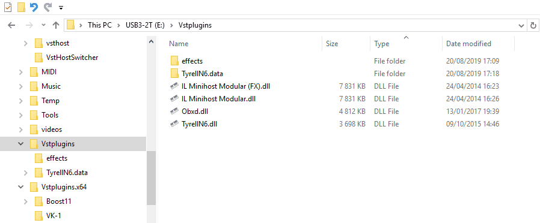
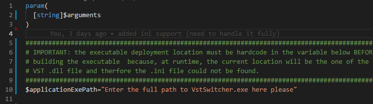
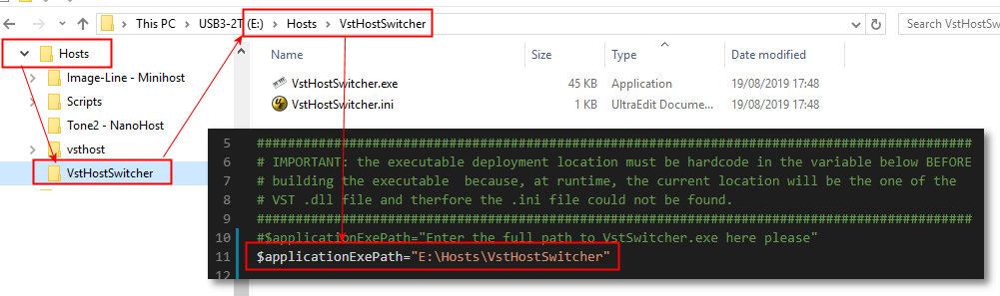
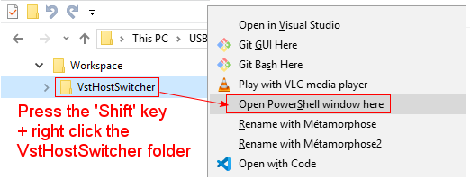
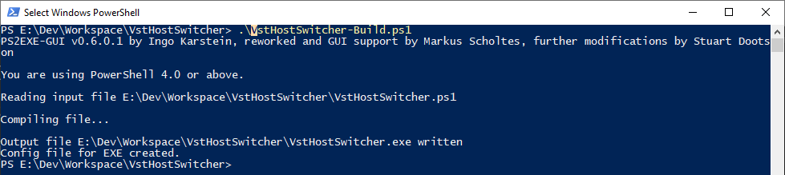
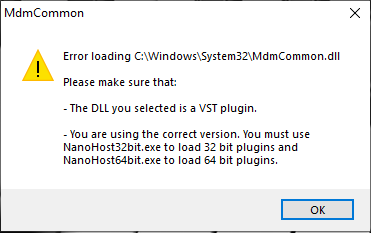

# VstHostSwitcher

## Description

The purpose of these small [PowerShell scripts](https://docs.microsoft.com/fr-fr/powershell/scripting/overview?view=powershell-6) is to simplify the automatic switching between 32 and 64 bits VST plugins hosts applications  installed on my MS Windows PC.

If you have both x86 and x64 version of VST plugins and you do not always need to launch a 'heavy' DAW to open them and do some 'knob tweaking' to create new sound presets, you may already use a VST plugin host application like the followings ones:

- [Tone 2 Nanohost](https://www.tone2.com/nanohost.html)
- [Image-Line MiniHostModular](https://forum.image-line.com/viewtopic.php?f=1919&t=123031)
- [Hermann Seib vsthost](http://www.hermannseib.com/english/vsthost.htm)

The problem is that 32 bits VST plugins cannot be open with a 64 bits VST host and vice versa. Therfore, the idea was to create an executable which could do the 32/64 bits VST host application switching automatically for me and associate it with the ``.dll`` files extension in the MS Windows file explorer. This way, simply by double clicking any ``vst.dll`` file I could quickly open it in my preferred VST host **independently to the fact that the .dll file is a 32 or 64 bit VST Plugin**:

In order to do this I needed:

- [A script containing the logic to choose between the 32 or 64 bits VST host.](#ANCHOR_SCRIPTS)
- [A way to specify custom PATH settings](#ANCHOR_SETTINGS)
- [A tool to compile this script to a MS Windows executable file.](#ANCHOR_EXE)
- [Associate this executable with any .dll file.](#ANCHOR_FILE_ASSOCIATION)

## Why two .ps1  script files

The ``VstHostSwitcher-Build.ps1`` script is provided as an example file to easily **build** the ``VstHostSwitcher.ps1`` file to an executable. I will give more details about the use of this script to build an executable [later on at the end of this page](#ANCHOR_EXE).  

The ``VstHostSwitcher.ps1`` script is containing all the logic to _guess_ if the ``path-to-the-vst-dl-to-launch`` is a 32 or 64 bits directory.  

**IMPORTANT**  
Please edit the ``$applicationExePath`` variable at line 10 of the ``VstHostSwitcher.ps1`` script to set the path location where you will copy/install the ``VstHostSwitcher-Build.exe`` executable built from the script.

This ``$applicationExePath`` variable will contain the folder path where you will store the ``VstHostSwitcher.exe`` executable and its associated ``VstHostSwitcher.ini`` file. If this variable is not set, the ``VstHostSwitcher.exe`` executable file won't be able to found the ``VstHostSwitcher.ini`` file containg the custom settings necessary for the ``VstHostSwitcher.exe`` to retrieve VST plugins and hosts installation paths which could be differents from one machine to the other.  
In the example below I have deployed / copied these two files in the ``E:\Hosts\VstHostSwitcher`` folder:

The _current script location_ cannot be guessed/used at runtime as this script location is unfortunately replaced by the VST plugin ``.dll`` file location given as argument to the script during the ``VstHostSwitcher.exe`` application execution. I could not found a way to fix this problem, therefore any sugestions will be greatly appreciated. Thanks in advance for any help.  

## Paths customization

It is possible to define your own directory structure to store your VST plugins and host location folders.  
These settings will be stored in the ``VstHostSwitcher.ini`` file.  
As mentioned previously, **the .ini file must be stored in the same directory as the  ``VstHostSwitcher.exe`` executable** for the ``VstHostSwitcher.exe`` application could be executed properly.  

The ``VstHostSwitcher.ini`` file has the following structure:

**Definitions for the x86 *VstPlugin* folder paths:**

> \[x86VstPluginFolderPaths\]  
> Path1=\[enter your first x86 VST plugins path here\]  
> Path2=\[enter your second x86 VST plugins path here\]  
> ...etc

You can defined here any number of VST plugin path location entries here. They will all be checked when a VST plugin .dll file will be given as program argument. You need to enter only x86 plugin paths here because if the given .dll file is not 'detected' as a x86 VST plugin the script will assume that it is a x64 one and will then use the x64 VST host application to load the .dll file.  

 Notice that if no VST plugins folder path is defined in the .ini file, the script will then try to retrieve it from the [MS Windows registry](https://en.wikipedia.org/wiki/Windows_Registry) or use the following default path location which is probably one of your current VST Plugins location:  

- C:\Program Files (x86)\Steinberg\VstPlugins\

**Definitions for the x86 and x64 VST host application(s) folder paths:**

> \[VstHostApplicationsPaths\]  
> preferredPath=2  
> x86Path1=\[enter your first x86 VST HOST path here\]  
> x64Path1=\[enter your first x64 VST HOST path here\]  
> x86Path2=\[enter your second x86 VST HOST path here\]  
> x64Path2=\[enter your second x64 VST HOST path here\]  
> ...etc

You can enter several pairs (x86 + x64) of VST host paths and specify your preferred one using the optionnal _preferredPath_ key. This will allow you to switch easily from one VST host to the other in case you need to tests something or a VST plugin is not fully _supported_ by a VST host application.  
If the _preferredPath_ key is not specified, the script will use the _xNNPath1_ pair of paths as default.

If no VST HOST application path is defined, the script will use the following default values respectively for the x86 and x64 default VST Host application path location:

- E:\Hosts\Tone2 - NanoHost\NanoHost32bit.exe
- E:\Hosts\Tone2 - NanoHost\NanoHost64bit.exe

These path entries will obviously only work if they are existing on your machine... ;o)
Therefore, I am strongly advising you to fill the ``VstHostSwitcher.ini`` file with **your own** path entries.

## Building an executable from the VstHostSwitcher.ps1 script

Now that we have updated the ``VstHostSwitcher.ini`` file with our own settings, we can try to build the executable.  
We will only need the **ps2exe script** that you can [download here](https://gallery.technet.microsoft.com/scriptcenter/PS2EXE-GUI-Convert-9b4b0493) for this task.

Once you have downloaded and extracted the zip file (i.e. for me in the _E:\Dev\Tools\PS2EXE_ directory) I am advising you to add the folder location where you unzip the file to your PATH environment variable. This way, you can simply run the ``VstHostSwitcher-Build.ps1`` script without having to modify it.  

Here is how to do so from the MS Windows file explorer:

Alternatively if you do not want to add the PS2EXE application in your default PATH environment variable, you can also simply prefix the ``ps2exe.ps1`` string with the path to the ``ps2exe.ps1`` script location in the ``VstHostSwitcher-Build.ps1`` script like in this example with the _E:\Dev\Tools\PS2EXE_ path as it is the place where I installed it:  
> ``E:\Dev\Tools\PS2EXE\ps2exe.ps1 VstHostSwitcher.ps1 VstHostSwitcher.exe -verbose -noConsole -iconfile VstHostSwitcher.ico``

You can also specify your own personal icon file name which will be integrated to the ``VstHostSwitcher.exe`` executable file if needed using the ``-iconfile`` argument.  
I found the one I am using in the above command line example [here](https://icon-icons.com/)...

Then, simply run the ``VstHostSwitcher-Build.ps1`` script to create the ``VstHostSwitcher.exe`` executable file.  
You can launch this script using the PowerShell window like this:  

And then type ``./VstHostSwitcher-Build.ps1`` and press the _ENTER_ key:  

Alternatively you can also open a simple DOS / cmd.exe window like the one below,  type ``powershell "./VstHostSwitcher-Build.ps1"`` and press the _ENTER_ key:  

Now you just have to chooose a folder location where to install/store the built executable. I personnally added it to the folder containing all my VST host applications but you could copy/install it anywhere else:  

Please simply keep in mind this path location in order to be able to easily retrieve it later on when associating the ``.dll`` file extension with the ``VstHostSwitcher.exe`` executable as explained in the next topic.

## Associating the VstHostSwitcher.exe executable with .dll file extension

Since we have built the ``VstHostSwitcher.exe`` executable we have now to **associate it with the VST ``.dll`` file extension**. Even if I agree that not all ``.dll`` files are VST plugins this is the only way I found to easily open a VST upon a double click.  

By the way, if you double click any non-VST ``.dll`` file, the ``VstHostSwitcher.exe`` executable will try to open it with the x64 VST host as the ``.dll`` path / folder won't match any x86 VST plugin path defined in the ``VstHostSwitcher.ini`` file. Then, depending on the VST host application error handling, it should show an error dialog saying that the given ``.dll`` file path is not a VST plugin.  
As an example, here is the error box for the [Tone 2 Nanohost](https://www.tone2.com/nanohost.html) VST host application:

Here is the way how to associate the ``.dll`` file extension with the  ``VstHostSwitcher.exe`` executable from the MS Windows file explorer:

If everything went well, the previously selected VST ``.dll`` file (during the file association process) should open.

Hope this help...

## Hmmm... I am not using MS Windows can I use your scripts

I think that PowerShell scripts can be adapted and executed to run on other OS ([LINUX](https://docs.microsoft.com/en-us/powershell/scripting/install/installing-powershell-core-on-linux?view=powershell-6) &  [MAC](https://docs.microsoft.com/en-us/powershell/scripting/install/installing-powershell-core-on-macos?view=powershell-6)) but I have no idea then how to build an executable for these platforms from a PowerSell script and how to associate the ``.dll`` equivalent ([.vst / .vst3 ?](https://helpcenter.steinberg.de/hc/en-us/articles/115000171310-VST-plug-in-locations-on-Mac-OS-X-and-macOS)) for MAC or Linux unfortunately.
