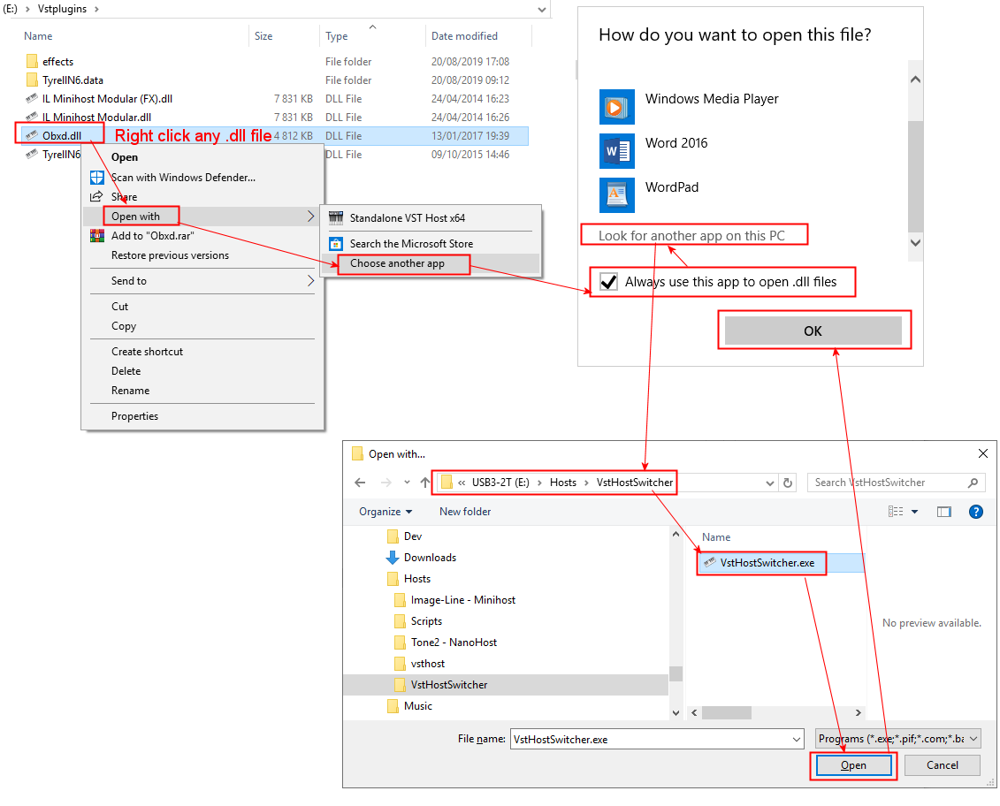

# VstHostSwitcher

## Description

The purpose of these [PowerShell scripts](https://docs.microsoft.com/fr-fr/powershell/scripting/overview?view=powershell-6) is to simplify the automatic switching between 32 and 64 bits VST plugins hosts installed on your MS Windows PC.

If you have both x86 and x64 version of VST plugins and you do not always need to launch a 'heavy' DAW to open them and do some 'knob tweaking' to create new sound presets, you may already use a VST plugin host application like the followings ones:

- [Tone 2 Nanohost](https://www.tone2.com/nanohost.html)
- [Image-Line MiniHostModular](https://forum.image-line.com/viewtopic.php?f=1919&t=123031)
- [Hermann Seib vsthost](http://www.hermannseib.com/english/vsthost.htm)

The problem is that 32 bits VST plugins cannot be open with a 64 bits VST host and vice versa. Therfore, the idea was to create an executable which could do the 32/64 bits VST host switching automatically for me and associate it with the ``.dll`` files extension in the MS Windows file explorer. This way, simply by double clicking any ``vst.dll`` file I could quickly open it in my preferred VST host **independently to the fact that the .dll file is a 32 or 64 bit VST Plugin**.

In order to do this I needed:

- [A script containing the logic to choose between the 32 or 64 bits VST host.](#ANCHOR_SCRIPTS)
- [A way to specify custom PATH settings](#ANCHOR_SETTINGS)
- [A tool to compile this script to a MS Widnows executable file.](#ANCHOR_EXE)
- [Associate this executable with any .dll file.](#ANCHOR_FILE_ASSOCIATION)

## Why two .ps1  script files

The ``VstHostSwitcher.ps1`` script is containing the logic to _guess_ if the ``path-to-the-vst-dl-to-launch`` is a 32 or 64 bits directory.  
The second script (``VstHostSwitcher-Build.ps1``) is provided as an example file to easily **build** the ``VstHostSwitcher.ps1`` file to an executable. Please see the [Building an executable with the scripts section](#ANCHOR_EXE) at the end of this file for more details.

**IMPORTANT**  
Please edit the ``$applicationExePath`` variable at line 10 of the ``VstHostSwitcher.ps1`` script to set the path location where you will copy/install the ``VstHostSwitcher-Build.exe`` executable built from the script.

This ``$applicationExePath`` variable will contain the folder path where you will store the ``VstHostSwitcher.exe`` executable and its associated ``VstHostSwitcher.ini`` file. If this variable is not set, the ``VstHostSwitcher.exe`` executable file won't be able to found the ``VstHostSwitcher.ini``.  
In the sample below I have deployed / copied these two files in the ``E:\Hosts\VstHostSwitcher`` folder:

The _current script location_ cannot be guessed/used at runtime as this script location is unfortunately replaced by the VST plugin ``.dll`` file location given as argument. I could not found a way to fix this. Therefore any sugestions will be greatly appreciated. Thanks in advance for any help.  

## Paths customization

It is possible to define your own directory structure to store your VST plugins and host location folders.
These settings will be stored in the ``VstHostSwitcher.ini`` file.  
As mentioned previously, **the .ini file must be stored in the same directory as the  ``VstHostSwitcher.exe`` executable**.  

The ``VstHostSwitcher.ini`` file has the following structure:

**Definitions for the x86 and x64 *VstPlugin* folder paths:**

> \[VstPluginFolderPaths\]  
> x86=\[enter your x86 VST plugins path here\]  
> x64=\[enter your x64 VST plugins path here\]  

Notice that if no VST plugins folder path is defined, the script will try to get it from the [MS Windows registry](https://en.wikipedia.org/wiki/Windows_Registry) or use the following default values respectively for the x86 and x64 default path location which are probably your current default location:  

- C:\Program Files (x86)\Steinberg\VstPlugins\
- C:\Program Files\Steinberg\VstPlugins\

This also means that the above ``VstPluginFolderPaths`` entries are optional...

**Definitions for the x86 and x64 VST _host(s)_ folder paths:**

> \[VstHostApplicationsPaths\]  
> preferred=Path2  
> x86Path1=\[enter your first x86 VST HOST path here\]  
> x64Path1=\[enter your first x64 VST HOST path here\]  
> x86Path2=\[enter your second x86 VST HOST path here\]  
> x64Path2=\[enter your second x64 VST HOST path here\]  
>...

You can enter several pairs (x86 + x64) of VST host paths and specify your preferred one using the optionnal _preferred_ key.  
If the _preferred_ key is not specified, the script will use the __xnnPath1__ pair of paths as default.

Notice that if no VST HOST application path is defined, the script will use the following default values respectively for the x86 and x64 default VST Host application path location:

- E:\Hosts\Tone2 - NanoHost\NanoHost32bit.exe
- E:\Hosts\Tone2 - NanoHost\NanoHost64bit.exe

...THese path entries will work obviously only if these path are existing on your machine... which I doubt.  
Therefore, I am strongly advising you to fill the ``VstHostSwitcher.ini`` file with **your own path entries**... ;o)

## Building an executable with the scripts

Now that we have updated the ``VstHostSwitcher.ini`` file with our own settings, we can try to build the executable.  
We will need the [ps2exe script that you can download here](https://gallery.technet.microsoft.com/scriptcenter/PS2EXE-GUI-Convert-9b4b0493) for this task.

Once you have downloaded and extracted the zip file (i.e. for me in the _E:\Dev\Tools\PS2EXE_ directory) I am advising you to add the folder location where you unzip the file to your PATH environment variable. This way, you can simply run the ``VstHostSwitcher-Build.ps1`` script without having to modify it.  
Here is how to do so from the MS Windows file explorer:

Notice that you can also specify your own personal icon file name if needed.  
I found [the one I am using here](https://icon-icons.com/)...

Alternatively, you can also simply prefix the ``ps2exe.ps1`` string with the path to the ``ps2exe.ps1`` script location in the ``VstHostSwitcher-Build.ps1`` script like in this example with the _E:\Dev\Tools\PS2EXE_ path as it is the place where I installed it:  
> ``E:\Dev\Tools\PS2EXE\ps2exe.ps1 VstHostSwitcher.ps1 VstHostSwitcher.exe -verbose -noConsole -iconfile VstHostSwitcher.ico``

Then, simply run the ``VstHostSwitcher-Build.ps1`` script to create the ``VstHostSwitcher.exe`` executable file.
You can launch this script using the PowerShell window like this:

And then type ``./VstHostSwitcher-Build.ps1`` and press the ENTER key:

Or type ``powershell "./VstHostSwitcher-Build.ps1"`` from s asimple DOS / cmd.exe window like this:

Now you just have to chooose a folder location to install/store the executable.  
I personnally added it to the folder containing all my VST host applications but you could copy it anywhere else. Please simply keep in mind its path location in order to be able to easily retrieve it later on when associating the ``.dll`` file extension with the ``VstHostSwitcher.exe`` executable as explained in the next topic.

## Associating the VstHostSwitcher.exe executable with .dll file extension

Since we have built the ``VstHostSwitcher.exe`` executable we have now to **associate it with the VST.dll file extension**.
Even if I agree that not all ``.dll`` files are VST plugins rhis is the only way I found to easily open a VST upon a double click.  
Here is how to do it from the MS Widnows file explorer:

If everything went well, the selected VST ``.dll`` file during the file association should open.

Hope this help...
