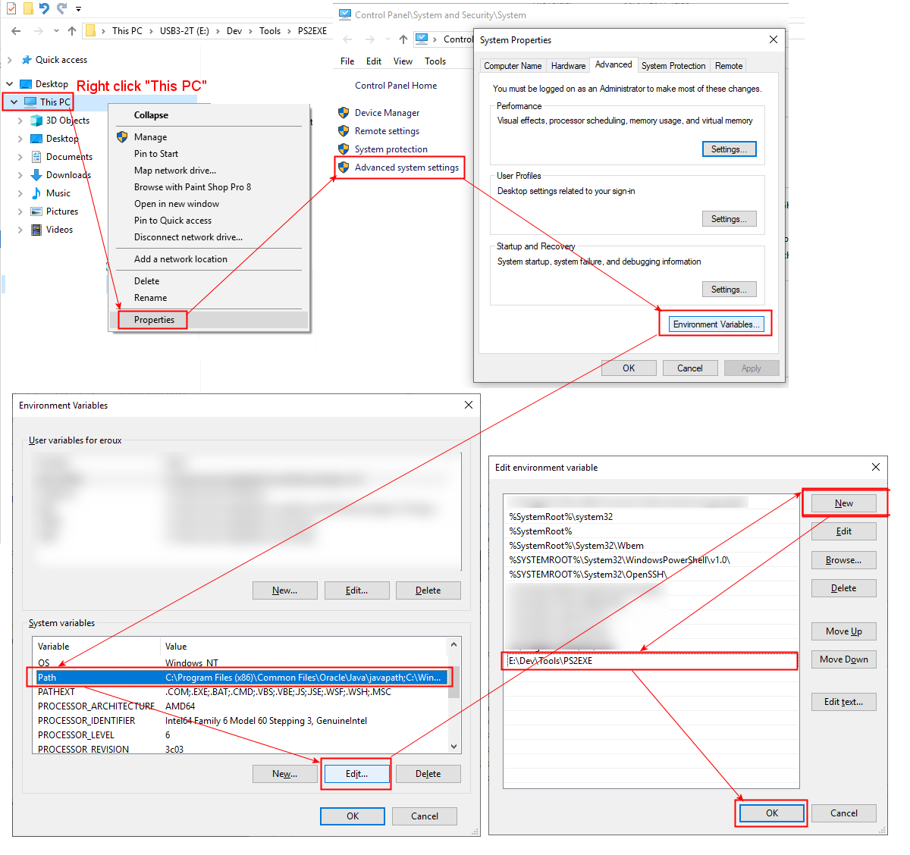

# VstHostSwitcher

## Description

The purpose of these scripts is to simplify the automatic switching between 32 and 64 bits VST plugins hosts installed on your MS Windows PC.

If (as me)  you you have both x86 and x64 version of VST PLugins and you do not always need to launch a 'heavy' DAW to open them and do soem knowb tweaking to create new sound presets, you may already use a VST plugin host like the one of following:

> - [Tone 2 Nanohost](https://www.tone2.com/nanohost.html)
> - [Image-Line MiniHostModular](https://forum.image-line.com/viewtopic.php?f=1919&t=123031)
> - [Hermannseib vsthost](http://www.hermannseib.com/english/vsthost.htm)

The main idea was to create an executable that will be associated with ``.dll`` files in the MS Windows file explorer so I could double click any vst.dll file and it will be open quickly in my preferred VST host indenpendently to the fact that the .dll is a 32 or 64 bit VST Plugin.
In order to do this I needed:

- [A script which contains the logic to choose between teh 32 or 64 bits VST host.](#ANCHOR_SCRIPTS)
- [A way to allow custom settings](#ANCHOR_SETTINGS)
- [A tool to compile this script to a MS Widnows executable file.](#ANCHOR_EXE)
- [Associate this executable with any .dll file.](#ANCHOR_FILE_ASSOCIATION)

## Why so many .ps1  script files

The ``VstHostSwitcher.ps1`` script is containing the logic to _guess_ if the ``path-to-the-vst-dl-to-launch`` is a 32 or 64 bits directory.
The second ``VstHostSwitcher-Build.ps1`` script is used as an example file to build the ``VstHostSwitcher.ps1`` file to an executable.
Please see the ``Building an executable with the scripts`` section at the end of this file for more details.

**IMPORTANT**
Please edit the ``VstHostSwitcher.ps1`` script at line 10 to set your own executable path location.
This is the place where you will store the ``VstHostSwitcher.exe`` executable and its associated ``VstHostSwitcher.ini`` file as otherwise the ``VstHostSwitcher.exe`` executable file won't be able to found the ``VstHostSwitcher.ini``. The current script location cannot be used at runtime as it becomes the VST plugin ``.dll`` file location unfortunately...
I could not found a way to fix this problem therefore any sugestions will be greatly appreciated. Thanks in advance for any help fixing this problem.  

## Paths customization

As there is not really any standardisation for the VST plugins and host location it is possible to define your own directory structure to store your VST plugins and host locations.
These settings are therefore stored in the ``VstHostSwitcher.ini`` file which must be stored in the same directory as the previously described scripts.
This ``VstHostSwitcher.ini`` file has the following structure:

**Definitions for the x86 and x64 *VstPlugin* folder paths:**

> \[VstPluginFolderPaths\]  
> x86=\[enter your x86 VST plugins path here\]  
> x64=\[enter your x64 VST plugins path here\]  

Notice that if no VST plugins folder path is defined, the script will try to get it from the MS Widows registry or use the following default values respectively for the x86 and x64 default path location:

> - C:\Program Files (x86)\Steinberg\VstPlugins\
> - C:\Program Files\Steinberg\VstPlugins\

**Definitions for the x86 and x64 VST _host(s)_ folder paths:**

> \[VstHostApplicationsPaths\]  
> preferred=Path2
> x86Path1=\[enter your first x86 VST HOST path here\]  
> x64Path1=\[enter your first x64 VST HOST path here\]
> x86Path2=\[enter your second x86 VST HOST path here\]
> x64Path2=\[enter your second x64 VST HOST path here\]
>...

You can enter several pairs (x86 + x64) of VST host paths and specify your preferred one using the optionnal _preferred_ key. If the _preferred_ is not specified the script will use the __xnnPath1__ pair of paths as default.

Notice that if no VST HOST application path is defined, the script will use the following default values respectively for the x86 and x64 default path location which will work obviously only if these path are existing on your machine... which I doubt, so I strongly advise you fill the ``VstHostSwitcher.ini`` with existing path extries...;o)

> E:\Hosts\Tone2 - NanoHost\NanoHost32bit.exe
> E:\Hosts\Tone2 - NanoHost\NanoHost64bit.exe

## Building an executable with the scripts

Now that you have updated the ``VstHostSwitcher.ini`` file with your own setings you can try to build the executable. To do so you will need the great [ps2exe script that you can download here](https://gallery.technet.microsoft.com/scriptcenter/PS2EXE-GUI-Convert-9b4b0493)

Once you have downloaded and extracted the zip file (i.e. for me in the _E:\Dev\Tools\PS2EXE_ directory) I advise you to add the folder location where you unzip the file to your PATH environment variable. This way, you can simply run the ``VstHostSwitcher-Build.ps1`` script.
Here is how to do so in MS Windows 10 file explorer:

Otherwise, please simply prefix the ps2exe.ps1 string with the path to the ``ps2exe.ps1`` script location in the ``VstHostSwitcher-Build.ps1`` script like this:
``E:\Dev\Tools\PS2EXE\ps2exe.ps1 VstHostSwitcher.ps1 VstHostSwitcher.exe -verbose -noConsole -iconfile VstHostSwitcher.ico``

Once you run the ``VstHostSwitcher-Build.ps1`` it will create then the  ``VstHostSwitcher.exe`` file.
Notice that you can also specify your own icon file name if neded.
I found [the one in this example here](https://icon-icons.com/)...

Now you just have to chooose a folder location where to deploy it.
I personnally add it to the VST host applications folder but you could copy it anywhere else, just keep in mind its location in order t be able to easily rtetrieve it when associating the ``.dll`` file extension with the ``VstHostSwitcher.exe`` executable as explained in the next topic below.

## Associating the ``VstHostSwitcher.exe`` executable with .dll file extension

Now that we have built the ``VstHostSwitcher.exe`` executable we have to associate it with the VST.dll file extension.
I agree that not all ``.dll`` files are VST plugins but the host files I know cannot open ``.vst3`` files unfortunately.
Here is how to do it from the MS Widnows file explorer:

If everything when well, it shoudl open the selected ``.dll``.

Hope this help...
